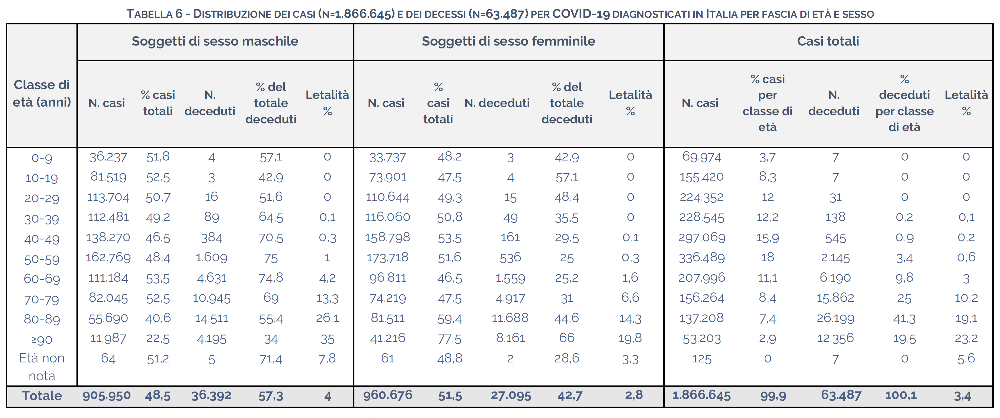

Machine-readable-Covid-19-ISS-data
==================================

I dati delle pubblicazioni periodiche dell'Istituto Superiore di Sanità (ISS) sull'epidemia da SARS-CoV-2 storicizzati e convertiti in formato machine-readable.

[](https://opensource.org/licenses/MIT)
[](https://img.shields.io/github/last-commit/emazep/Machine-readable-Covid-19-ISS-data/commits/master)

## Descrizione

Attualmente questo repository contiene i dati storicizzati dei contagi e dei decessi verificatisi in Italia a seguito dell'epidemia da SARS-CoV-2 stratificati per classe d'età e per sesso, estratti dal report denominato ***Dati della Sorveglianza integrata COVID-19 in Italia - Documento esteso***, pubblicato in formato PDF con cadenza all'incirca settimanale sulla seguente pagina del sito istituzionale dell'ISS:
https://www.epicentro.iss.it/coronavirus/sars-cov-2-sorveglianza-dati, nonché il codice per scaricare in locale tutti i predetti documenti ad oggi pubblicati e per effettuare su di essi le operazioni di estrazione dei dati (mediante PDF scraping) e di reshaping degli stessi. Per quanto ci risulta, tali dati non sono disponibili altrove in formato machine-readable (né storicizzati).

Più precisamente, i dati estratti sono quelli raccolti nella tabella che, nel documento originale in formato PDF, appare come segue:



la quale contiene come detto il numero dei casi diagnosticati e dei decessi, stratificato per classe d'età e per sesso, cumulato dall'inizio dell'epidemia alla data di pubblicazione del documento in questione (lo screenshot di cui sopra, che ha valenza puramente esemplificativa, è stato estratto dal documento del 16/12/2020).

Per quanto attiene alle operazioni di data reshaping, ogni singola tabella estratta dal corrispondente documento è stata serializzata in un'unica riga della tabella finale, indicizzata tramite la data di pubblicazione del documento, in modo da avere lo storico di tutte le tabelle pubblicate.

Nel tabella finale i dati, privati della struttura gerarchica originale, appaiono quindi distribuiti nelle seguenti colonne:

- la colonna _chiave_, denominata `date`, valorizzata con la data in formato ISO 8601 (`yyyy-mm-gg`) del documento da cui è stata estratta la riga corrispondente;
- le 10 colonne dei casi dei maschi per fascia d'età, denominate `cases_male_<fascia_eta>`, dove la sottostringa `<fascia_eta>` assume (anche nel seguito) i 10 valori: `0-9`, `10-19`, `20-29`, `30-39`, `40-49`, `50-59`, `60-69`, `70-79`, `80-89`, `90-`;
- le 10 colonne dei decessi dei maschi per fascia d'età, denominate `deaths_male_<fascia_eta>`;
- le 10 colonne dei casi delle femmine per fascia d'età, denominate `cases_female_<fascia_eta>`;
- le 10 colonne dei decessi delle femmine per fascia d'età, denominate `deaths_female_<fascia_eta>`;
- le 10 colonne dei casi senza stratificazione per sesso per fascia d'età, denominate `cases_total_<fascia_eta>`;
- le 10 colonne dei decessi senza stratificazione per sesso per fascia d'età, denominate `deaths_total_<fascia_eta>`;

per un totale di 40 colonne (esclusa la colonna chiave).

Per quanto riguarda gli altri dati della tabella orginale (percentuali e letalità), si è deciso di non acquisirli in quanto funzionalmente dipendenti dai dati predetti e quindi da essi derivabili (si è fatta un'eccezione per le sole colonne dei totali sull'età), in maniera molto semplice (si consulti il paragrafo [Cookbook](#cookbook)).

La tabella finale sopra descritta è presente nella directory `data/` col nome di `italy_cases_deaths_by_age_sex.csv` e la sua struttura può essere immediatamente compresa per semplice ispezione visiva della renderizzazione che ne offre GitHub:
https://github.com/emazep/Machine-readable-Covid-19-ISS-data/blob/master/data/italy_cases_deaths_by_age_sex.csv

## Limitazioni

I dati soffrono di alcune limitazioni, dovute alla modalità di pubblicazione degli stessi da parte dell'ISS:

- i valori della chiave (la data di pubblicazione) non sono equispaziati: l'ISS ha pubblicato i dati con cadenza grossomodo settimanale ma, di tanto in tanto, tra un documento e il successivo sono trascorsi intervalli più lunghi o più brevi di 7 giorni (i documenti sono stati e verranno sempre acquisiti tutti, sicché l'utente è libero di effettuare eventuali operazioni di decimazione o interpolazione);
- per giunta anche l'orario di estrazione dal proprio database dei dati pubblicati da parte dell'ISS è difforme da documento a documento;
- benché i dati siano cumulati e quindi i valori debbano essere non decrescenti nel tempo, di tanto in tanto (raramente) si osservano dei valori decrescenti da una data alla successiva (forse per via di redistribuzioni di alcuni dati tra le varie fasce d'età);
- i dati imputati nella tabella originale alla riga `Età non nota` non sono stati acquisiti in quanto non interpretabili: i valori hanno una notevole erraticità per cui certamente non sono cumulati, ma non è chiaro se si tratti di dati differenziali o (più probabilmente) di dati che diminuiscono di valore per intervenuta attribuzione ad una specifica classe d'età (in ogni caso si tratta di valori piuttosto contenuti);
- benché il primo documento di questa serie (pubblicato dall'ISS in data 09/03/2020) sia stato regolarmente scaricato e sia presente anche in questo repository, da esso non è stato possibile acquisire i dati, in quanto la tabella contenuta appare limitata alla sola stratificazione per classe d'età e, per giunta, con le ultime due classi, che nei documenti successivi sono sempre separate (80-89 e ≥90), che in questo caso appaiono invece raccolte in un'unica classe (≥80); i dati estratti partono pertanto dal documento successivo, riferibile alla data 12/03/2020 (si tratta peraltro di uno dei casi in cui il tempo intercorso tra due documenti successivi è inferiore ai 7 giorni).

## Uso

I dati estratti, in formato CSV, possono essere utilizzati direttamente, facendo riferimento al file:

https://raw.githubusercontent.com/emazep/Machine-readable-Covid-19-ISS-data/master/data/italy_cases_deaths_by_age_sex.csv

che conterrà sempre lo storico di tutti i dati aggiornati all'ultimo documento disponibile, che verrà acquisito il prima possibile (ci si propone entro qualche ora dalla pubblicazione sul sito dell'ISS).

### Cookbook

I seguenti snippet fanno riferimento esclusivamente alla libreria Python [pandas](https://pandas.pydata.org/).

Caricamento di pandas:

```
import pandas as pd
```

Caricamento dei dati (aggiornati) in un dataframe (con riconoscimento e parsing automatico dell'indice in oggetti di tipo datetime):

```
SOURCE = 'https://raw.githubusercontent.com/emazep/Machine-readable-Covid-19-ISS-data/master/data/italy_cases_deaths_by_age_sex.csv'

df = pd.read_csv(SOURCE, index_col=0, parse_dates=True)
```

Aggiunta di una colonna con i valori incrementali (ovvero le differenze col valore precedente nella colonna) per ogni colonna del dataframe:

```
for col in df.columns:
    df[col + '_DELTA'] = df[col].diff()
```

Calcolo dei casi e dei decessi totali (maschi + femmine) per ogni classe d'età:

```
AGE_CLASSES = ['0-9', '10-19', '20-29', '30-39', '40-49', '50-59', '60-69', '70-79', '80-89', '90-']

for age_class in AGE_CLASSES:
    df['cases_total_' + age_class] = df['cases_male_' + age_class] + df['cases_female_' + age_class]
    df['deaths_total_' + age_class] = df['deaths_male_' + age_class] + df['deaths_female_' + age_class]
```

Aggiunta di una colonna contenente il CFR (_Confirmed Fatality Rate_, dato dal rapporto tra i decessi cumulati alla data corrente e i casi cumulati alla data precedente disponibile) per ogni classe d'età, espresso in percentuale (si assume che sia già stato eseguito lo snippet precedente):

```
for age_class in AGE_CLASSES:
    df['CFR_' + age_class] = (df['deaths_total_' + age_class] / df['cases_total_' + age_class].shift()) * 100
```

### Uso degli script

L'uso degli script non è necessario, a meno che non si intenda scaricare i documenti dell'ISS ed estrarne i dati in autonomia.

Gli script sono stati redatti in codice Python e sono reperibili nella directory `script/`.

Per installarne i prerequisiti, eseguire:

```
pip install -r requirements.txt
```

Lo script `bollettino_sorveglianza_integrata_download.py` si incarica di scaricare e salvare in locale i documenti dell'ISS, nonché di normalizzarne i nomi dei file. Lo script al momento non accetta parametri dalla linea di comando, per cui se se ne vuole customizzare il funzionamento è necessario valorizzare opportunamente le variabili globali in testa al codice (sufficientemente documentate). Tuttavia il comportamento di default è quello che dovrebbe andare bene nella maggior parte dei casi: vengono scaricati tutti i documenti pubblicati sul sito dell'ISS, nell'ordine che va dal più recente al più remoto, e salvati in locale nella directory `../original_ISS_documents/bollettino_sorveglianza_integrata/` col nome file opportunamente normalizzato, mentre in caso di successiva esecuzione lo script si interrompe al primo documento trovato che risulta già scaricato (il più recente), in modo da poter essere lanciato periodicamente per scaricare i nuovi documenti, senza che venga inutilmente ripetuto anche il download di quelli precedenti.

Il codice per l'estrazione dei dati dai documenti scaricati viene invece fornito come notebook Jupyter (nel file `bollettino_sorveglianza_integrata_ETL.ipynb`), data la sua natura maggiormente interattiva, dovuta al fatto che, sulla base dei documenti fin qui pubblicati, risulta purtroppo altamente probabile che quelli futuri presentino difformità nella presentazione dei dati tali da richiedere adattamenti nel codice di scraping (adattamenti che si è cercato comunque di limitare alla valorizzazione di un paio di parametri).

## Roadmap

I dati in formato machine-readable presenti in questo repository verranno aggiornati entro qualche ora dalla pubblicazione dei nuovi report da parte dell'ISS.

Non si esclude che in futuro possano essere acquisiti anche altri dati dalle pubblicazioni dell'ISS.

Si consultino le [segnalazioni aperte](https://github.com/emazep/Machine-readable-Covid-19-ISS-data/issues) per la lista delle feature proposte (e dei problemi noti).

## Come contribuire

I contributi maggiormente apprezzati riguardano il controllo della correttezza dei dati estratti ma anche eventuali suggerimenti riguardo nuovi dati da estrarre, avendo cura in quest'ultimo caso di fornire i dovuti link e di controllare che non si tratti di dati già disponibili in formato machine-readable altrove (ad esempio sul [repository GitHub della Protezione Civile](https://github.com/pcm-dpc/COVID-19)).

Per quanto riguarda i contributi al codice, si prega di attenersi agli standard desumibili dal codice presente. A meno che non si tratti di contributi minimi, la procedura da seguire è:

1. forkare il progetto;
2. creare un Branch per le vostre Feature (`git checkout -b feature/AmazingFeature`);
3. committare le modifiche/aggiunte apportate (`git commit -m 'Add some AmazingFeature'`);
4. pushare le modifiche sul Branch (`git push origin feature/AmazingFeature`);
5. aprire una Pull Request.

## Licenza

The code in this repository is distributed under the MIT License. See the file `LICENSE.txt` for more information.

## Autore

Emanuele Zeppieri

## Contatti

Emanuele Zeppieri - [@emazep](https://twitter.com/emazep)

Project Link: [https://github.com/emazep/Machine-readable-Covid-19-ISS-data](https://github.com/emazep/Machine-readable-Covid-19-ISS-data)